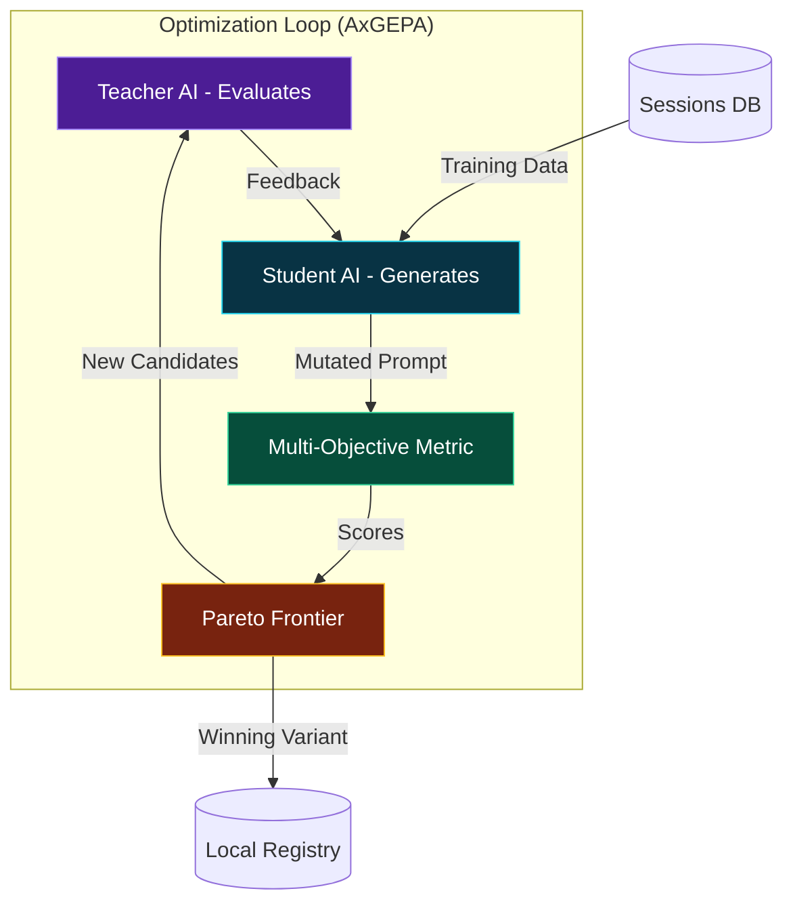

# GEPA Prompt Optimization: Analytical Deep Dive

> Automatically evolve and improve insight-generation prompts using Multi-Objective Genetic-Pareto Optimization.

---

## Overview

**GEPA (Genetic-Pareto)** is the automated prompt engineering engine of Code Insights. It eliminates the need for manual prompt tweaking by treating prompt optimization as a machine learning training problem.

Instead of a developer guessing which wording "might" produce better insights, GEPA runs a systematic evolutionary loop: it tries hundreds of prompt variants against real session data, scores them across four competing objectives, and selects the mathematical "best" variant on the Pareto frontier.

---

## The Evolutionary Loop

The system operates on a **Student-Teacher architecture**:

1.  **Preparation**: The system loads real session transcripts from your local database as training and validation examples.
2.  **Inference (Student)**: A faster, cost-effective model (the "Student") generates insights using a mutated prompt variant.
3.  **Evaluation (Teacher)**: A high-reasoning model (the "Teacher") evaluates the student's output.
4.  **Scoring (Multi-Objective)**: The teacher's feedback is converted into quantitative scores for:
    -   **Coverage**: Did it capture all the key themes of the session?
    -   **Precision**: Are the insights dense and free of "hallucinated" or trivial filler?
    -   **Actionability**: Does it provide concrete, prescriptive guidance?
    -   **Brevity**: Is it concise enough to keep costs low and readability high?
5.  **Pareto Selection**: The loop tracks "non-dominated" solutions—prompts that excel in one objective without being significantly worse in others.

### System Architecture

[View Live Architecture Diagram (Interactive HTML)](../assets/gepa-optimization-diagram.html)



---

## Measuring Quality: The Objectives

The power of GEPA lies in its ability to balance competing goals. In prompt engineering, there is often a trade-off between **Coverage** (more info) and **Brevity** (less tokens). GEPA finds the "sweet spot."

| Objective | Logic | Scoring Constraint |
| :--- | :--- | :--- |
| **Coverage** | Topic overlap between transcript and output. | 0 = Missed everything; 100 = 100% overlap. |
| **Precision** | Ratio of specific references (file paths, errors) to filler. | Penalizes generic "fluff" or neutral summaries. |
| **Actionability** | Presence of "Action Verbs" and prescriptive guidance. | 0 = Observations; 100 = Specific "Should/Avoid" advice. |
| **Brevity** | Token count normalized against a desired target. | Penalizes "chatty" responses that inflate LLM costs. |

---

## Artifacts and Persistence

Code Insights stores all optimization results locally in `~/.code-insights/optimizations/`.

-   **`manifest.json`**: The central registry tracking all versions and the current active ID.
-   **`artifact.json`**: The serialized "AxProgram"—this is the "binary" of your prompt. It contains the exact instructions the AI uses.
-   **`scores.json`**: The proof of performance, showing exactly how this version performed on the Pareto frontier compared to its predecessors.

---

## CLI Integration

You can manage the full lifecycle of your prompts from the terminal:

```bash
# Start an optimization run (recommends gpt-4o-mini student + claude-3.5-sonnet teacher)
code-insights optimize run

# Compare two versions to see the "delta" in actionability and precision
code-insights optimize compare v1 v7

# List all local prompt versions
code-insights optimize list
```

## Why it Matters

Manual prompt engineering is "vibe-based." You change a word and *feel* like it might be better. GEPA is **evidence-based**. It ensures that as you analyze thousands of coding sessions, the insights you receive are becoming more actionable, more precise, and more cost-efficient over time.
